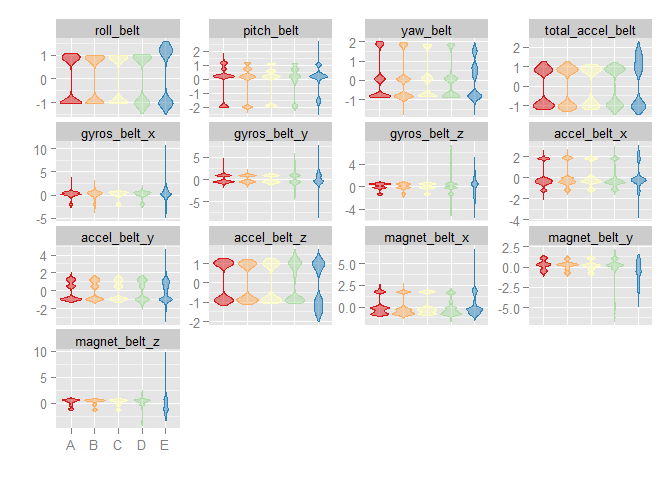
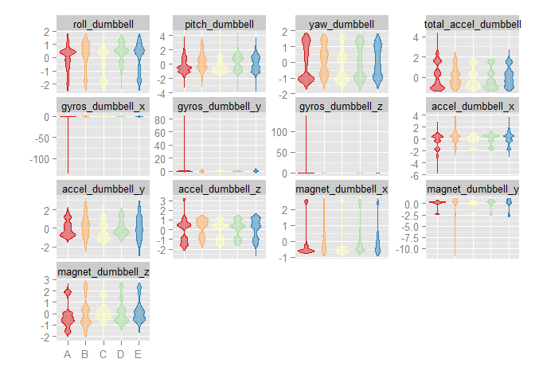
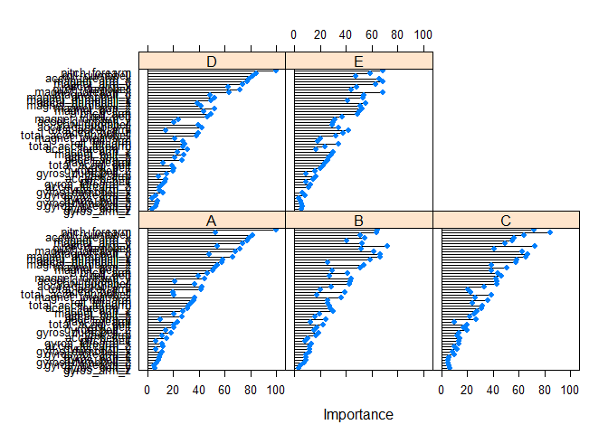

# Coursera: Practical Machine Learning Prediction Assignment
Benjamin Chan  


```
## Run time: 2014-10-22 06:01:52
## R version: R version 3.1.1 (2014-07-10)
```

> **Background**

> Using devices such as Jawbone Up, Nike FuelBand, and Fitbit it is now possible to collect a large amount of data about personal activity relatively inexpensively. These type of devices are part of the quantified self movement - a group of enthusiasts who take measurements about themselves regularly to improve their health, to find patterns in their behavior, or because they are tech geeks. One thing that people regularly do is quantify how much of a particular activity they do, but they rarely quantify how well they do it. In this project, your goal will be to use data from accelerometers on the belt, forearm, arm, and dumbell of 6 participants. They were asked to perform barbell lifts correctly and incorrectly in 5 different ways. More information is available from the website here: http://groupware.les.inf.puc-rio.br/har (see the section on the Weight Lifting Exercise Dataset). 


> **Data **

> The training data for this project are available here: 

> https://d396qusza40orc.cloudfront.net/predmachlearn/pml-training.csv

> The test data are available here: 

> https://d396qusza40orc.cloudfront.net/predmachlearn/pml-testing.csv

> The data for this project come from this source: http://groupware.les.inf.puc-rio.br/har. If you use the document you create for this class for any purpose please cite them as they have been very generous in allowing their data to be used for this kind of assignment. 

> **What you should submit**

> The goal of your project is to predict the manner in which they did the exercise. This is the "classe" variable in the training set. You may use any of the other variables to predict with. You should create a report describing how you built your model, how you used cross validation, what you think the expected out of sample error is, and why you made the choices you did. You will also use your prediction model to predict 20 different test cases. 

> 1. Your submission should consist of a link to a Github repo with your R markdown and compiled HTML file describing your analysis. Please constrain the text of the writeup to < 2000 words and the number of figures to be less than 5. It will make it easier for the graders if you submit a repo with a gh-pages branch so the HTML page can be viewed online (and you always want to make it easy on graders :-).
> 2. You should also apply your machine learning algorithm to the 20 test cases available in the test data above. Please submit your predictions in appropriate format to the programming assignment for automated grading. See the programming assignment for additional details. 

> **Reproducibility **

> Due to security concerns with the exchange of R code, your code will not be run during the evaluation by your classmates. Please be sure that if they download the repo, they will be able to view the compiled HTML version of your analysis. 


# Get the datasets

Read the training data into a data table.


```r
require(data.table)
```

```
## Loading required package: data.table
```

```r
setInternet2(TRUE)
url <- "https://d396qusza40orc.cloudfront.net/predmachlearn/pml-training.csv"
DTrain <- fread(url)
```

Make `classe` into a factor.


```r
classe <- factor(DTrain[, classe])
is.factor(classe)
```

```
## [1] TRUE
```

```r
table(classe)
```

```
## classe
##    A    B    C    D    E 
## 5580 3797 3422 3216 3607
```

Read the testing data into a data table.


```r
require(data.table)
setInternet2(TRUE)
url <- "https://d396qusza40orc.cloudfront.net/predmachlearn/pml-testing.csv"
DTest <- fread(url)
```

Which variables in the test dataset have zero `NA`s?
Use this tip: [finding columns with all missing values in r](http://stackoverflow.com/a/11330265).
Use these variables as the **predictor candidates**.


```r
isAnyMissing <- sapply(DTest, function (x) any(is.na(x) | x == ""))
table(isAnyMissing)
```

```
## isAnyMissing
## FALSE  TRUE 
##    60   100
```

```r
predCandidates <- names(isAnyMissing)[!isAnyMissing & grepl("belt|arm|dumbbell|forearm", names(isAnyMissing))]
predCandidates
```

```
##  [1] "roll_belt"            "pitch_belt"           "yaw_belt"            
##  [4] "total_accel_belt"     "gyros_belt_x"         "gyros_belt_y"        
##  [7] "gyros_belt_z"         "accel_belt_x"         "accel_belt_y"        
## [10] "accel_belt_z"         "magnet_belt_x"        "magnet_belt_y"       
## [13] "magnet_belt_z"        "roll_arm"             "pitch_arm"           
## [16] "yaw_arm"              "total_accel_arm"      "gyros_arm_x"         
## [19] "gyros_arm_y"          "gyros_arm_z"          "accel_arm_x"         
## [22] "accel_arm_y"          "accel_arm_z"          "magnet_arm_x"        
## [25] "magnet_arm_y"         "magnet_arm_z"         "roll_dumbbell"       
## [28] "pitch_dumbbell"       "yaw_dumbbell"         "total_accel_dumbbell"
## [31] "gyros_dumbbell_x"     "gyros_dumbbell_y"     "gyros_dumbbell_z"    
## [34] "accel_dumbbell_x"     "accel_dumbbell_y"     "accel_dumbbell_z"    
## [37] "magnet_dumbbell_x"    "magnet_dumbbell_y"    "magnet_dumbbell_z"   
## [40] "roll_forearm"         "pitch_forearm"        "yaw_forearm"         
## [43] "total_accel_forearm"  "gyros_forearm_x"      "gyros_forearm_y"     
## [46] "gyros_forearm_z"      "accel_forearm_x"      "accel_forearm_y"     
## [49] "accel_forearm_z"      "magnet_forearm_x"     "magnet_forearm_y"    
## [52] "magnet_forearm_z"
```

Subset the training dataset to include only the **predictor candidates**.


```r
varToInclude <- c("classe", predCandidates)
DTrain <- DTrain[, varToInclude, with=FALSE]
str(DTrain)
```

```
## Classes 'data.table' and 'data.frame':	19622 obs. of  53 variables:
##  $ classe              : chr  "A" "A" "A" "A" ...
##  $ roll_belt           : num  1.41 1.41 1.42 1.48 1.48 1.45 1.42 1.42 1.43 1.45 ...
##  $ pitch_belt          : num  8.07 8.07 8.07 8.05 8.07 8.06 8.09 8.13 8.16 8.17 ...
##  $ yaw_belt            : num  -94.4 -94.4 -94.4 -94.4 -94.4 -94.4 -94.4 -94.4 -94.4 -94.4 ...
##  $ total_accel_belt    : int  3 3 3 3 3 3 3 3 3 3 ...
##  $ gyros_belt_x        : num  0 0.02 0 0.02 0.02 0.02 0.02 0.02 0.02 0.03 ...
##  $ gyros_belt_y        : num  0 0 0 0 0.02 0 0 0 0 0 ...
##  $ gyros_belt_z        : num  -0.02 -0.02 -0.02 -0.03 -0.02 -0.02 -0.02 -0.02 -0.02 0 ...
##  $ accel_belt_x        : int  -21 -22 -20 -22 -21 -21 -22 -22 -20 -21 ...
##  $ accel_belt_y        : int  4 4 5 3 2 4 3 4 2 4 ...
##  $ accel_belt_z        : int  22 22 23 21 24 21 21 21 24 22 ...
##  $ magnet_belt_x       : int  -3 -7 -2 -6 -6 0 -4 -2 1 -3 ...
##  $ magnet_belt_y       : int  599 608 600 604 600 603 599 603 602 609 ...
##  $ magnet_belt_z       : int  -313 -311 -305 -310 -302 -312 -311 -313 -312 -308 ...
##  $ roll_arm            : num  -128 -128 -128 -128 -128 -128 -128 -128 -128 -128 ...
##  $ pitch_arm           : num  22.5 22.5 22.5 22.1 22.1 22 21.9 21.8 21.7 21.6 ...
##  $ yaw_arm             : num  -161 -161 -161 -161 -161 -161 -161 -161 -161 -161 ...
##  $ total_accel_arm     : int  34 34 34 34 34 34 34 34 34 34 ...
##  $ gyros_arm_x         : num  0 0.02 0.02 0.02 0 0.02 0 0.02 0.02 0.02 ...
##  $ gyros_arm_y         : num  0 -0.02 -0.02 -0.03 -0.03 -0.03 -0.03 -0.02 -0.03 -0.03 ...
##  $ gyros_arm_z         : num  -0.02 -0.02 -0.02 0.02 0 0 0 0 -0.02 -0.02 ...
##  $ accel_arm_x         : int  -288 -290 -289 -289 -289 -289 -289 -289 -288 -288 ...
##  $ accel_arm_y         : int  109 110 110 111 111 111 111 111 109 110 ...
##  $ accel_arm_z         : int  -123 -125 -126 -123 -123 -122 -125 -124 -122 -124 ...
##  $ magnet_arm_x        : int  -368 -369 -368 -372 -374 -369 -373 -372 -369 -376 ...
##  $ magnet_arm_y        : int  337 337 344 344 337 342 336 338 341 334 ...
##  $ magnet_arm_z        : int  516 513 513 512 506 513 509 510 518 516 ...
##  $ roll_dumbbell       : num  13.1 13.1 12.9 13.4 13.4 ...
##  $ pitch_dumbbell      : num  -70.5 -70.6 -70.3 -70.4 -70.4 ...
##  $ yaw_dumbbell        : num  -84.9 -84.7 -85.1 -84.9 -84.9 ...
##  $ total_accel_dumbbell: int  37 37 37 37 37 37 37 37 37 37 ...
##  $ gyros_dumbbell_x    : num  0 0 0 0 0 0 0 0 0 0 ...
##  $ gyros_dumbbell_y    : num  -0.02 -0.02 -0.02 -0.02 -0.02 -0.02 -0.02 -0.02 -0.02 -0.02 ...
##  $ gyros_dumbbell_z    : num  0 0 0 -0.02 0 0 0 0 0 0 ...
##  $ accel_dumbbell_x    : int  -234 -233 -232 -232 -233 -234 -232 -234 -232 -235 ...
##  $ accel_dumbbell_y    : int  47 47 46 48 48 48 47 46 47 48 ...
##  $ accel_dumbbell_z    : int  -271 -269 -270 -269 -270 -269 -270 -272 -269 -270 ...
##  $ magnet_dumbbell_x   : int  -559 -555 -561 -552 -554 -558 -551 -555 -549 -558 ...
##  $ magnet_dumbbell_y   : int  293 296 298 303 292 294 295 300 292 291 ...
##  $ magnet_dumbbell_z   : num  -65 -64 -63 -60 -68 -66 -70 -74 -65 -69 ...
##  $ roll_forearm        : num  28.4 28.3 28.3 28.1 28 27.9 27.9 27.8 27.7 27.7 ...
##  $ pitch_forearm       : num  -63.9 -63.9 -63.9 -63.9 -63.9 -63.9 -63.9 -63.8 -63.8 -63.8 ...
##  $ yaw_forearm         : num  -153 -153 -152 -152 -152 -152 -152 -152 -152 -152 ...
##  $ total_accel_forearm : int  36 36 36 36 36 36 36 36 36 36 ...
##  $ gyros_forearm_x     : num  0.03 0.02 0.03 0.02 0.02 0.02 0.02 0.02 0.03 0.02 ...
##  $ gyros_forearm_y     : num  0 0 -0.02 -0.02 0 -0.02 0 -0.02 0 0 ...
##  $ gyros_forearm_z     : num  -0.02 -0.02 0 0 -0.02 -0.03 -0.02 0 -0.02 -0.02 ...
##  $ accel_forearm_x     : int  192 192 196 189 189 193 195 193 193 190 ...
##  $ accel_forearm_y     : int  203 203 204 206 206 203 205 205 204 205 ...
##  $ accel_forearm_z     : int  -215 -216 -213 -214 -214 -215 -215 -213 -214 -215 ...
##  $ magnet_forearm_x    : int  -17 -18 -18 -16 -17 -9 -18 -9 -16 -22 ...
##  $ magnet_forearm_y    : num  654 661 658 658 655 660 659 660 653 656 ...
##  $ magnet_forearm_z    : num  476 473 469 469 473 478 470 474 476 473 ...
##  - attr(*, ".internal.selfref")=<externalptr>
```

```r
sum(is.na(DTrain))
```

```
## [1] 0
```

Preprocess the prediction variables by centering and scaling.


```r
require(caret)
```

```
## Loading required package: caret
## Loading required package: lattice
## Loading required package: ggplot2
```

```r
preProc <- preProcess(DTrain[, predCandidates, with=FALSE])
preProc
```

```
## 
## Call:
## preProcess.default(x = DTrain[, predCandidates, with = FALSE])
## 
## Created from 19622 samples and 52 variables
## Pre-processing: centered, scaled
```

```r
DTrainCS <- data.table(predict(preProc, DTrain[, predCandidates, with=FALSE]))
DTrainCS <- DTrainCS[, classe := classe]
```

Check for near zero variance.


```r
nearZeroVar(DTrainCS, saveMetrics=TRUE)
```

```
##                      freqRatio percentUnique zeroVar   nzv
## roll_belt                1.102       6.77811   FALSE FALSE
## pitch_belt               1.036       9.37723   FALSE FALSE
## yaw_belt                 1.058       9.97350   FALSE FALSE
## total_accel_belt         1.063       0.14779   FALSE FALSE
## gyros_belt_x             1.059       0.71348   FALSE FALSE
## gyros_belt_y             1.144       0.35165   FALSE FALSE
## gyros_belt_z             1.066       0.86128   FALSE FALSE
## accel_belt_x             1.055       0.83580   FALSE FALSE
## accel_belt_y             1.114       0.72877   FALSE FALSE
## accel_belt_z             1.079       1.52380   FALSE FALSE
## magnet_belt_x            1.090       1.66650   FALSE FALSE
## magnet_belt_y            1.100       1.51870   FALSE FALSE
## magnet_belt_z            1.006       2.32902   FALSE FALSE
## roll_arm                52.338      13.52563   FALSE FALSE
## pitch_arm               87.256      15.73234   FALSE FALSE
## yaw_arm                 33.029      14.65702   FALSE FALSE
## total_accel_arm          1.025       0.33636   FALSE FALSE
## gyros_arm_x              1.016       3.27693   FALSE FALSE
## gyros_arm_y              1.454       1.91622   FALSE FALSE
## gyros_arm_z              1.111       1.26389   FALSE FALSE
## accel_arm_x              1.017       3.95984   FALSE FALSE
## accel_arm_y              1.140       2.73672   FALSE FALSE
## accel_arm_z              1.128       4.03629   FALSE FALSE
## magnet_arm_x             1.000       6.82397   FALSE FALSE
## magnet_arm_y             1.057       4.44399   FALSE FALSE
## magnet_arm_z             1.036       6.44685   FALSE FALSE
## roll_dumbbell            1.022      84.19121   FALSE FALSE
## pitch_dumbbell           2.245      49.37825   FALSE FALSE
## yaw_dumbbell             1.132      83.47263   FALSE FALSE
## total_accel_dumbbell     1.073       0.21914   FALSE FALSE
## gyros_dumbbell_x         1.003       1.22821   FALSE FALSE
## gyros_dumbbell_y         1.265       1.41678   FALSE FALSE
## gyros_dumbbell_z         1.060       1.04984   FALSE FALSE
## accel_dumbbell_x         1.018       2.16594   FALSE FALSE
## accel_dumbbell_y         1.053       2.37489   FALSE FALSE
## accel_dumbbell_z         1.133       2.08949   FALSE FALSE
## magnet_dumbbell_x        1.098       5.74865   FALSE FALSE
## magnet_dumbbell_y        1.198       4.30129   FALSE FALSE
## magnet_dumbbell_z        1.021       3.44511   FALSE FALSE
## roll_forearm            11.589      11.08959   FALSE FALSE
## pitch_forearm           65.983      14.85577   FALSE FALSE
## yaw_forearm             15.323      10.14677   FALSE FALSE
## total_accel_forearm      1.129       0.35674   FALSE FALSE
## gyros_forearm_x          1.059       1.51870   FALSE FALSE
## gyros_forearm_y          1.037       3.77637   FALSE FALSE
## gyros_forearm_z          1.123       1.56457   FALSE FALSE
## accel_forearm_x          1.126       4.04648   FALSE FALSE
## accel_forearm_y          1.059       5.11161   FALSE FALSE
## accel_forearm_z          1.006       2.95587   FALSE FALSE
## magnet_forearm_x         1.012       7.76679   FALSE FALSE
## magnet_forearm_y         1.247       9.54031   FALSE FALSE
## magnet_forearm_z         1.000       8.57711   FALSE FALSE
## classe                   1.470       0.02548   FALSE FALSE
```

Examine groups of prediction variables.


```r
histGroup <- function (data, regex) {
  col <- grep(regex, names(data))
  col <- c(col, which(names(data) == "classe"))
  require(reshape2)
  n <- nrow(data)
  DMelted <- melt(data[, col, with=FALSE][, rownum := seq(1, n)], id.vars=c("rownum", "classe"))
  require(ggplot2)
  ggplot(DMelted, aes(x=classe, y=value)) +
    geom_violin(aes(color=classe, fill=classe), alpha=1/2) +
#     geom_smooth(aes(group=1), method="glm") +
    facet_wrap(~ variable, scale="free_y") +
    scale_color_brewer(palette="Spectral") +
    scale_fill_brewer(palette="Spectral") +
    labs(x="", y="") +
    theme(legend.position="none")
}
histGroup(DTrainCS, "belt")
```

```
## Loading required package: reshape2
```

 

```r
histGroup(DTrainCS, "[^(fore)]arm")
```

 

```r
histGroup(DTrainCS, "dumbbell")
```

 

```r
histGroup(DTrainCS, "forearm")
```

 


# Train a prediction model

Set up the parallel clusters.


```r
require(parallel)
```

```
## Loading required package: parallel
```

```r
require(doParallel)
```

```
## Loading required package: doParallel
## Loading required package: foreach
## Loading required package: iterators
```

```r
cl <- makeCluster(2)
registerDoParallel(cl)
```

Set the control parameters.


```r
ctrl <- trainControl(classProbs=TRUE,
                     savePredictions=TRUE,
                     allowParallel=TRUE)
```

Preprocess with PCA.


```r
preProc <- preProcess(DTrain[, predCandidates, with=FALSE], method="pca")
trainPC <- predict(preProc, DTrain[, predCandidates, with=FALSE])
# M1 <- train(classe ~ ., data=trainPC, method="glm")
# testPC <- predict(preProc, testing[predVar])
# hat1 <- predict(M1, testPC)
# confusionMatrix(testing$diagnosis, hat1)
```

Fit model over the tuning parameters.


```r
method <- "ctree"
M0 <- train(classe ~ ., data=DTrainCS, method=method)
```

```
## Loading required package: party
## Loading required package: grid
## Loading required package: zoo
## 
## Attaching package: 'zoo'
## 
## The following objects are masked from 'package:base':
## 
##     as.Date, as.Date.numeric
## 
## Loading required package: sandwich
## Loading required package: strucchange
## Loading required package: modeltools
## Loading required package: stats4
```

```r
# M1 <- train(classe ~ ., data=trainPC, method=method)
```

Stop the clusters.


```r
stopCluster(cl)
```

Evaluate the model.


```r
M0
```

```
## Conditional Inference Tree 
## 
## 19622 samples
##    52 predictor
##     5 classes: 'A', 'B', 'C', 'D', 'E' 
## 
## No pre-processing
## Resampling: Bootstrapped (25 reps) 
## 
## Summary of sample sizes: 19622, 19622, 19622, 19622, 19622, 19622, ... 
## 
## Resampling results across tuning parameters:
## 
##   mincriterion  Accuracy  Kappa  Accuracy SD  Kappa SD
##   0.01          0.9       0.9    0.007        0.009   
##   0.50          0.9       0.9    0.007        0.009   
##   0.99          0.9       0.9    0.007        0.009   
## 
## Accuracy was used to select the optimal model using  the largest value.
## The final value used for the model was mincriterion = 0.01.
```

```r
confusionMatrix(predict(M0), classe)
```

```
## Confusion Matrix and Statistics
## 
##           Reference
## Prediction    A    B    C    D    E
##          A 5435  113   26   48   15
##          B   78 3504  100   62   64
##          C   18   87 3225   97   40
##          D   39   53   48 2980   40
##          E   10   40   23   29 3448
## 
## Overall Statistics
##                                         
##                Accuracy : 0.948         
##                  95% CI : (0.944, 0.951)
##     No Information Rate : 0.284         
##     P-Value [Acc > NIR] : < 2e-16       
##                                         
##                   Kappa : 0.934         
##  Mcnemar's Test P-Value : 1.8e-05       
## 
## Statistics by Class:
## 
##                      Class: A Class: B Class: C Class: D Class: E
## Sensitivity             0.974    0.923    0.942    0.927    0.956
## Specificity             0.986    0.981    0.985    0.989    0.994
## Pos Pred Value          0.964    0.920    0.930    0.943    0.971
## Neg Pred Value          0.990    0.981    0.988    0.986    0.990
## Prevalence              0.284    0.194    0.174    0.164    0.184
## Detection Rate          0.277    0.179    0.164    0.152    0.176
## Detection Prevalence    0.287    0.194    0.177    0.161    0.181
## Balanced Accuracy       0.980    0.952    0.964    0.958    0.975
```

```r
varImp(M0)
```

```
## Loading required package: pROC
## Type 'citation("pROC")' for a citation.
## 
## Attaching package: 'pROC'
## 
## The following objects are masked from 'package:stats':
## 
##     cov, smooth, var
```

```
## ROC curve variable importance
## 
##   variables are sorted by maximum importance across the classes
##   only 20 most important variables shown (out of 52)
## 
##                       A    B    C     D    E
## pitch_forearm     100.0 64.1 71.8 100.0 68.3
## roll_dumbbell      52.9 63.7 84.4  84.4 58.8
## accel_forearm_x    81.7 51.2 64.0  81.7 47.5
## magnet_arm_x       78.8 54.6 56.5  78.8 66.1
## magnet_arm_y       77.3 40.7 54.9  77.3 68.5
## accel_arm_x        73.9 52.4 48.9  73.9 62.7
## pitch_dumbbell     54.3 72.2 72.2  62.5 48.2
## magnet_forearm_x   72.0 51.4 40.8  72.0 43.9
## magnet_belt_y      68.4 61.3 62.7  63.2 68.4
## magnet_dumbbell_y  47.9 66.4 66.4  48.5 53.8
## magnet_dumbbell_x  66.4 66.4 65.6  52.0 53.2
## accel_dumbbell_x   58.2 58.6 58.6  49.1 41.4
## magnet_dumbbell_z  57.7 26.1 57.7  38.7 55.4
## magnet_arm_z       53.9 53.9 38.7  41.9 50.9
## magnet_belt_z      52.1 50.9 50.7  52.5 52.5
## pitch_arm          50.6 29.0 39.1  44.0 50.6
## roll_belt          46.4 41.6 43.4  49.0 49.0
## magnet_forearm_y   39.4 26.9 46.8  46.8 37.1
## accel_dumbbell_z   44.2 44.2 42.1  23.9 31.7
## yaw_dumbbell       21.7 43.1 43.1  20.6 29.7
```

```r
plot(varImp(M0))
```

 

```r
# M1
# confusionMatrix(predict(M1), classe)
# varImp(M1)
```

Save training mode object for later.


```r
save(M0, file="trainingModel.RData")
```
