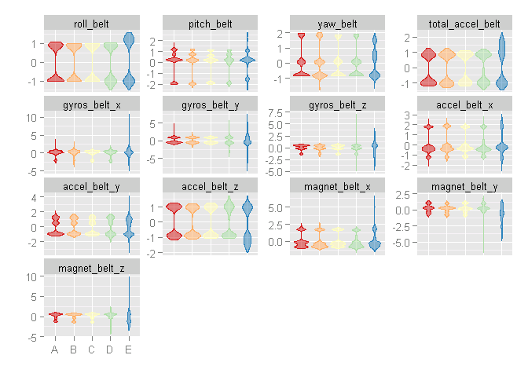
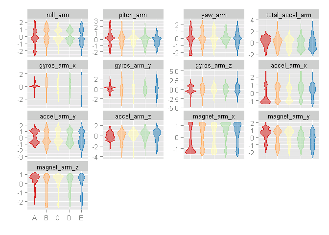
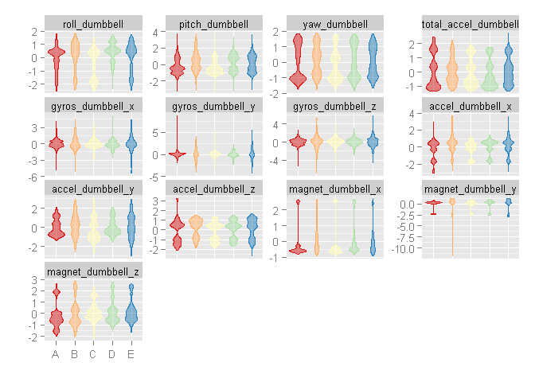
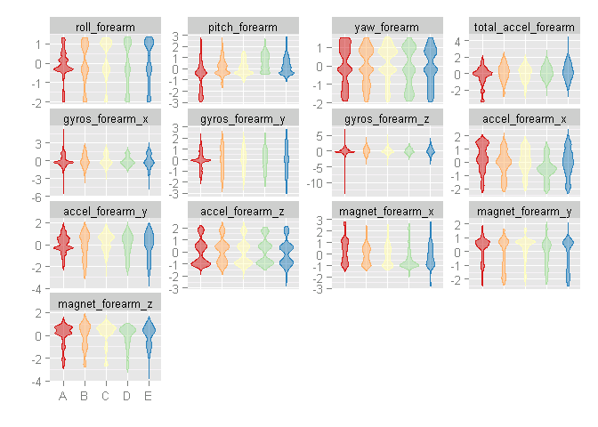

# Coursera: Practical Machine Learning Prediction Assignment
Benjamin Chan [GitHub](https://github.com/benjamin-chan)  


```
## Run time: 2014-10-23 15:40:34
## R version: R version 3.1.1 (2014-07-10)
```

> **Background**

> Using devices such as Jawbone Up, Nike FuelBand, and Fitbit it is now possible to collect a large amount of data about personal activity relatively inexpensively. These type of devices are part of the quantified self movement - a group of enthusiasts who take measurements about themselves regularly to improve their health, to find patterns in their behavior, or because they are tech geeks. One thing that people regularly do is quantify how much of a particular activity they do, but they rarely quantify how well they do it. In this project, your goal will be to use data from accelerometers on the belt, forearm, arm, and dumbell of 6 participants. They were asked to perform barbell lifts correctly and incorrectly in 5 different ways. More information is available from the website here: http://groupware.les.inf.puc-rio.br/har (see the section on the Weight Lifting Exercise Dataset). 


> **Data **

> The training data for this project are available here: 

> https://d396qusza40orc.cloudfront.net/predmachlearn/pml-training.csv

> The test data are available here: 

> https://d396qusza40orc.cloudfront.net/predmachlearn/pml-testing.csv

> The data for this project come from this source: http://groupware.les.inf.puc-rio.br/har. If you use the document you create for this class for any purpose please cite them as they have been very generous in allowing their data to be used for this kind of assignment. 

> **What you should submit**

> The goal of your project is to predict the manner in which they did the exercise. This is the "classe" variable in the training set. You may use any of the other variables to predict with. You should create a report describing how you built your model, how you used cross validation, what you think the expected out of sample error is, and why you made the choices you did. You will also use your prediction model to predict 20 different test cases. 

> 1. Your submission should consist of a link to a Github repo with your R markdown and compiled HTML file describing your analysis. Please constrain the text of the writeup to < 2000 words and the number of figures to be less than 5. It will make it easier for the graders if you submit a repo with a gh-pages branch so the HTML page can be viewed online (and you always want to make it easy on graders :-).
> 2. You should also apply your machine learning algorithm to the 20 test cases available in the test data above. Please submit your predictions in appropriate format to the programming assignment for automated grading. See the programming assignment for additional details. 

> **Reproducibility **

> Due to security concerns with the exchange of R code, your code will not be run during the evaluation by your classmates. Please be sure that if they download the repo, they will be able to view the compiled HTML version of your analysis. 


# Prepare the datasets

Read the training data into a data table.


```r
require(data.table)
```

```
## Loading required package: data.table
```

```r
setInternet2(TRUE)
url <- "https://d396qusza40orc.cloudfront.net/predmachlearn/pml-training.csv"
D <- fread(url)
```

Read the testing data into a data table.


```r
url <- "https://d396qusza40orc.cloudfront.net/predmachlearn/pml-testing.csv"
DTest <- fread(url)
```

Which variables in the test dataset have zero `NA`s?
Use this tip: [finding columns with all missing values in r](http://stackoverflow.com/a/11330265).

Belt, arm, dumbbell, and forearm variables that do not have any missing values in the test dataset will be **predictor candidates**.


```r
isAnyMissing <- sapply(DTest, function (x) any(is.na(x) | x == ""))
isPredictor <- !isAnyMissing & grepl("belt|[^(fore)]arm|dumbbell|forearm", names(isAnyMissing))
predCandidates <- names(isAnyMissing)[isPredictor]
predCandidates
```

```
##  [1] "roll_belt"            "pitch_belt"           "yaw_belt"            
##  [4] "total_accel_belt"     "gyros_belt_x"         "gyros_belt_y"        
##  [7] "gyros_belt_z"         "accel_belt_x"         "accel_belt_y"        
## [10] "accel_belt_z"         "magnet_belt_x"        "magnet_belt_y"       
## [13] "magnet_belt_z"        "roll_arm"             "pitch_arm"           
## [16] "yaw_arm"              "total_accel_arm"      "gyros_arm_x"         
## [19] "gyros_arm_y"          "gyros_arm_z"          "accel_arm_x"         
## [22] "accel_arm_y"          "accel_arm_z"          "magnet_arm_x"        
## [25] "magnet_arm_y"         "magnet_arm_z"         "roll_dumbbell"       
## [28] "pitch_dumbbell"       "yaw_dumbbell"         "total_accel_dumbbell"
## [31] "gyros_dumbbell_x"     "gyros_dumbbell_y"     "gyros_dumbbell_z"    
## [34] "accel_dumbbell_x"     "accel_dumbbell_y"     "accel_dumbbell_z"    
## [37] "magnet_dumbbell_x"    "magnet_dumbbell_y"    "magnet_dumbbell_z"   
## [40] "roll_forearm"         "pitch_forearm"        "yaw_forearm"         
## [43] "total_accel_forearm"  "gyros_forearm_x"      "gyros_forearm_y"     
## [46] "gyros_forearm_z"      "accel_forearm_x"      "accel_forearm_y"     
## [49] "accel_forearm_z"      "magnet_forearm_x"     "magnet_forearm_y"    
## [52] "magnet_forearm_z"
```

Subset the primary dataset to include only the **predictor candidates** and the outcome variable, `classe`.


```r
varToInclude <- c("classe", predCandidates)
D <- D[, varToInclude, with=FALSE]
dim(D)
```

```
## [1] 19622    53
```

```r
names(D)
```

```
##  [1] "classe"               "roll_belt"            "pitch_belt"          
##  [4] "yaw_belt"             "total_accel_belt"     "gyros_belt_x"        
##  [7] "gyros_belt_y"         "gyros_belt_z"         "accel_belt_x"        
## [10] "accel_belt_y"         "accel_belt_z"         "magnet_belt_x"       
## [13] "magnet_belt_y"        "magnet_belt_z"        "roll_arm"            
## [16] "pitch_arm"            "yaw_arm"              "total_accel_arm"     
## [19] "gyros_arm_x"          "gyros_arm_y"          "gyros_arm_z"         
## [22] "accel_arm_x"          "accel_arm_y"          "accel_arm_z"         
## [25] "magnet_arm_x"         "magnet_arm_y"         "magnet_arm_z"        
## [28] "roll_dumbbell"        "pitch_dumbbell"       "yaw_dumbbell"        
## [31] "total_accel_dumbbell" "gyros_dumbbell_x"     "gyros_dumbbell_y"    
## [34] "gyros_dumbbell_z"     "accel_dumbbell_x"     "accel_dumbbell_y"    
## [37] "accel_dumbbell_z"     "magnet_dumbbell_x"    "magnet_dumbbell_y"   
## [40] "magnet_dumbbell_z"    "roll_forearm"         "pitch_forearm"       
## [43] "yaw_forearm"          "total_accel_forearm"  "gyros_forearm_x"     
## [46] "gyros_forearm_y"      "gyros_forearm_z"      "accel_forearm_x"     
## [49] "accel_forearm_y"      "accel_forearm_z"      "magnet_forearm_x"    
## [52] "magnet_forearm_y"     "magnet_forearm_z"
```

Make `classe` into a factor.


```r
D <- D[, classe := factor(D[, classe])]
D[, .N, classe]
```

```
##    classe    N
## 1:      A 5580
## 2:      B 3797
## 3:      C 3422
## 4:      D 3216
## 5:      E 3607
```

Split the dataset into a 60% training and 40% probing dataset.


```r
require(caret)
```

```
## Loading required package: caret
## Loading required package: lattice
## Loading required package: ggplot2
```

```r
seed <- as.numeric(as.Date("2014-10-26"))
set.seed(seed)
inTrain <- createDataPartition(D$classe, p=0.6)
DTrain <- D[inTrain[[1]]]
DProbe <- D[-inTrain[[1]]]
```

Preprocess the prediction variables by centering and scaling.


```r
X <- DTrain[, predCandidates, with=FALSE]
preProc <- preProcess(X)
preProc
```

```
## 
## Call:
## preProcess.default(x = X)
## 
## Created from 11776 samples and 52 variables
## Pre-processing: centered, scaled
```

```r
XCS <- predict(preProc, X)
DTrainCS <- data.table(data.frame(classe = DTrain[, classe], XCS))
```

Apply the centering and scaling to the probing dataset.


```r
X <- DProbe[, predCandidates, with=FALSE]
XCS <- predict(preProc, X)
DProbeCS <- data.table(data.frame(classe = DProbe[, classe], XCS))
```

Check for near zero variance.


```r
nzv <- nearZeroVar(DTrainCS, saveMetrics=TRUE)
if (any(nzv$nzv)) nzv else message("No variables with near zero variance")
```

```
## No variables with near zero variance
```

Examine groups of prediction variables.


```r
histGroup <- function (data, regex) {
  col <- grep(regex, names(data))
  col <- c(col, which(names(data) == "classe"))
  require(reshape2)
  n <- nrow(data)
  DMelted <- melt(data[, col, with=FALSE][, rownum := seq(1, n)], id.vars=c("rownum", "classe"))
  require(ggplot2)
  ggplot(DMelted, aes(x=classe, y=value)) +
    geom_violin(aes(color=classe, fill=classe), alpha=1/2) +
#     geom_jitter(aes(color=classe, fill=classe), alpha=1/10) +
#     geom_smooth(aes(group=1), method="gam", color="black", alpha=1/2, size=2) +
    facet_wrap(~ variable, scale="free_y") +
    scale_color_brewer(palette="Spectral") +
    scale_fill_brewer(palette="Spectral") +
    labs(x="", y="") +
    theme(legend.position="none")
}
histGroup(DTrainCS, "belt")
```

```
## Loading required package: reshape2
```

 

```r
histGroup(DTrainCS, "[^(fore)]arm")
```

 

```r
histGroup(DTrainCS, "dumbbell")
```

 

```r
histGroup(DTrainCS, "forearm")
```

 


# Train a prediction model

Using random forest, the out of sample error should be small.
The error will be estimated using the 40% probing sample.
I would be quite happy with an error estimate of 3% or less.

Set up the parallel clusters.


```r
require(parallel)
```

```
## Loading required package: parallel
```

```r
require(doParallel)
```

```
## Loading required package: doParallel
## Loading required package: foreach
## Loading required package: iterators
```

```r
cl <- makeCluster(detectCores() - 1)
registerDoParallel(cl)
```

Set the control parameters.


```r
ctrl <- trainControl(classProbs=TRUE,
                     savePredictions=TRUE,
                     allowParallel=TRUE)
```

Fit model over the tuning parameters.


```r
method <- "rf"
system.time(trainingModel <- train(classe ~ ., data=DTrainCS, method=method))
```

```
## Loading required package: randomForest
## randomForest 4.6-10
## Type rfNews() to see new features/changes/bug fixes.
```

```
##    user  system elapsed 
##   50.36    0.18 1482.91
```

Stop the clusters.


```r
stopCluster(cl)
```

## Evaluate the model on the training dataset


```r
trainingModel
```

```
## Random Forest 
## 
## 11776 samples
##    52 predictor
##     5 classes: 'A', 'B', 'C', 'D', 'E' 
## 
## No pre-processing
## Resampling: Bootstrapped (25 reps) 
## 
## Summary of sample sizes: 11776, 11776, 11776, 11776, 11776, 11776, ... 
## 
## Resampling results across tuning parameters:
## 
##   mtry  Accuracy  Kappa  Accuracy SD  Kappa SD
##    2    1         1      0.002        0.002   
##   27    1         1      0.002        0.002   
##   52    1         1      0.004        0.006   
## 
## Accuracy was used to select the optimal model using  the largest value.
## The final value used for the model was mtry = 27.
```

```r
hat <- predict(trainingModel, DTrainCS)
confusionMatrix(hat, DTrain[, classe])
```

```
## Confusion Matrix and Statistics
## 
##           Reference
## Prediction    A    B    C    D    E
##          A 3348    0    0    0    0
##          B    0 2279    0    0    0
##          C    0    0 2054    0    0
##          D    0    0    0 1930    0
##          E    0    0    0    0 2165
## 
## Overall Statistics
##                                 
##                Accuracy : 1     
##                  95% CI : (1, 1)
##     No Information Rate : 0.284 
##     P-Value [Acc > NIR] : <2e-16
##                                 
##                   Kappa : 1     
##  Mcnemar's Test P-Value : NA    
## 
## Statistics by Class:
## 
##                      Class: A Class: B Class: C Class: D Class: E
## Sensitivity             1.000    1.000    1.000    1.000    1.000
## Specificity             1.000    1.000    1.000    1.000    1.000
## Pos Pred Value          1.000    1.000    1.000    1.000    1.000
## Neg Pred Value          1.000    1.000    1.000    1.000    1.000
## Prevalence              0.284    0.194    0.174    0.164    0.184
## Detection Rate          0.284    0.194    0.174    0.164    0.184
## Detection Prevalence    0.284    0.194    0.174    0.164    0.184
## Balanced Accuracy       1.000    1.000    1.000    1.000    1.000
```

## Evaluate the model on the probing dataset


```r
hat <- predict(trainingModel, DProbeCS)
confusionMatrix(hat, DProbeCS[, classe])
```

```
## Confusion Matrix and Statistics
## 
##           Reference
## Prediction    A    B    C    D    E
##          A 2230   16    0    0    0
##          B    1 1498    6    2    2
##          C    0    4 1353   18    7
##          D    0    0    9 1265    7
##          E    1    0    0    1 1426
## 
## Overall Statistics
##                                         
##                Accuracy : 0.991         
##                  95% CI : (0.988, 0.993)
##     No Information Rate : 0.284         
##     P-Value [Acc > NIR] : <2e-16        
##                                         
##                   Kappa : 0.988         
##  Mcnemar's Test P-Value : NA            
## 
## Statistics by Class:
## 
##                      Class: A Class: B Class: C Class: D Class: E
## Sensitivity             0.999    0.987    0.989    0.984    0.989
## Specificity             0.997    0.998    0.996    0.998    1.000
## Pos Pred Value          0.993    0.993    0.979    0.988    0.999
## Neg Pred Value          1.000    0.997    0.998    0.997    0.998
## Prevalence              0.284    0.193    0.174    0.164    0.184
## Detection Rate          0.284    0.191    0.172    0.161    0.182
## Detection Prevalence    0.286    0.192    0.176    0.163    0.182
## Balanced Accuracy       0.998    0.993    0.992    0.991    0.994
```

## Display the final model


```r
varImp(trainingModel)
```

```
## rf variable importance
## 
##   only 20 most important variables shown (out of 52)
## 
##                      Overall
## roll_belt             100.00
## pitch_forearm          59.81
## yaw_belt               54.35
## pitch_belt             45.92
## magnet_dumbbell_z      43.76
## roll_forearm           43.52
## magnet_dumbbell_y      43.32
## accel_dumbbell_y       22.41
## roll_dumbbell          18.30
## magnet_dumbbell_x      17.99
## accel_forearm_x        17.50
## accel_belt_z           14.59
## magnet_belt_z          14.43
## accel_dumbbell_z       13.94
## magnet_forearm_z       13.91
## total_accel_dumbbell   13.20
## magnet_belt_y          12.33
## yaw_arm                11.81
## gyros_belt_z           11.18
## magnet_belt_x           9.19
```

```r
trainingModel$finalModel
```

```
## 
## Call:
##  randomForest(x = x, y = y, mtry = param$mtry) 
##                Type of random forest: classification
##                      Number of trees: 500
## No. of variables tried at each split: 27
## 
##         OOB estimate of  error rate: 0.79%
## Confusion matrix:
##      A    B    C    D    E class.error
## A 3341    5    2    0    0    0.002091
## B   16 2255    7    1    0    0.010531
## C    0   10 2037    7    0    0.008277
## D    0    1   27 1899    3    0.016062
## E    1    2    2    9 2151    0.006467
```

**The estimated error rate is less than 1%.**

Save training model object for later.


```r
save(trainingModel, file="trainingModel.RData")
```


# Predict on the test data

Load the training model.


```r
load(file="trainingModel.RData", verbose=TRUE)
```

```
## Loading objects:
##   trainingModel
```

Get predictions and evaluate.


```r
DTestCS <- predict(preProc, DTest[, predCandidates, with=FALSE])
hat <- predict(trainingModel, DTestCS)
DTest <- cbind(hat , DTest)
subset(DTest, select=names(DTest)[grep("belt|[^(fore)]arm|dumbbell|forearm", names(DTest), invert=TRUE)])
```

```
##     hat V1 user_name raw_timestamp_part_1 raw_timestamp_part_2
##  1:   B  1     pedro           1323095002               868349
##  2:   A  2    jeremy           1322673067               778725
##  3:   B  3    jeremy           1322673075               342967
##  4:   A  4    adelmo           1322832789               560311
##  5:   A  5    eurico           1322489635               814776
##  6:   E  6    jeremy           1322673149               510661
##  7:   D  7    jeremy           1322673128               766645
##  8:   B  8    jeremy           1322673076                54671
##  9:   A  9  carlitos           1323084240               916313
## 10:   A 10   charles           1322837822               384285
## 11:   B 11  carlitos           1323084277                36553
## 12:   C 12    jeremy           1322673101               442731
## 13:   B 13    eurico           1322489661               298656
## 14:   A 14    jeremy           1322673043               178652
## 15:   E 15    jeremy           1322673156               550750
## 16:   E 16    eurico           1322489713               706637
## 17:   A 17     pedro           1323094971               920315
## 18:   B 18  carlitos           1323084285               176314
## 19:   B 19     pedro           1323094999               828379
## 20:   B 20    eurico           1322489658               106658
##       cvtd_timestamp new_window num_window problem_id
##  1: 05/12/2011 14:23         no         74          1
##  2: 30/11/2011 17:11         no        431          2
##  3: 30/11/2011 17:11         no        439          3
##  4: 02/12/2011 13:33         no        194          4
##  5: 28/11/2011 14:13         no        235          5
##  6: 30/11/2011 17:12         no        504          6
##  7: 30/11/2011 17:12         no        485          7
##  8: 30/11/2011 17:11         no        440          8
##  9: 05/12/2011 11:24         no        323          9
## 10: 02/12/2011 14:57         no        664         10
## 11: 05/12/2011 11:24         no        859         11
## 12: 30/11/2011 17:11         no        461         12
## 13: 28/11/2011 14:14         no        257         13
## 14: 30/11/2011 17:10         no        408         14
## 15: 30/11/2011 17:12         no        779         15
## 16: 28/11/2011 14:15         no        302         16
## 17: 05/12/2011 14:22         no         48         17
## 18: 05/12/2011 11:24         no        361         18
## 19: 05/12/2011 14:23         no         72         19
## 20: 28/11/2011 14:14         no        255         20
```

## Submission to Coursera

Write submission files to `predictionAssignment_files/answers`.


```r
pml_write_files = function(x){
  n = length(x)
  path <- "predictionAssignment_files/answers"
  for(i in 1:n){
    filename = paste0("problem_id_",i,".txt")
    write.table(x[i],file=file.path(path, filename),quote=FALSE,row.names=FALSE,col.names=FALSE)
  }
}
pml_write_files(hat)
```
